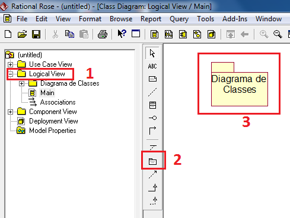
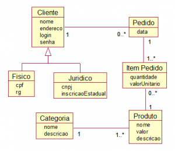
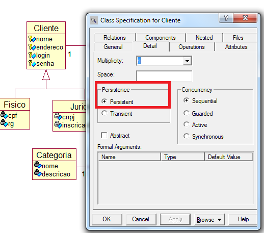
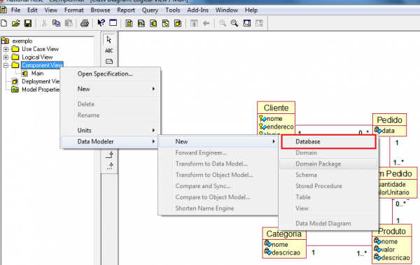
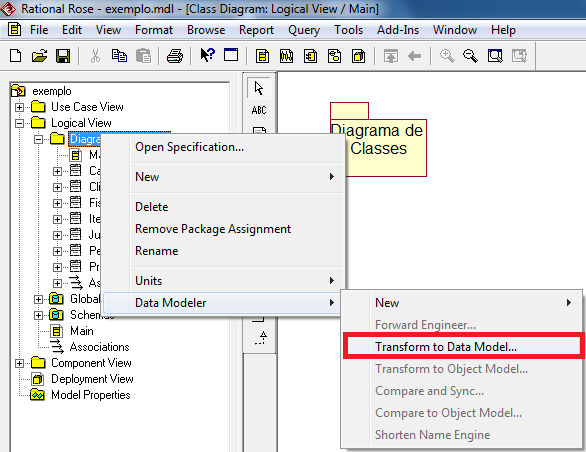
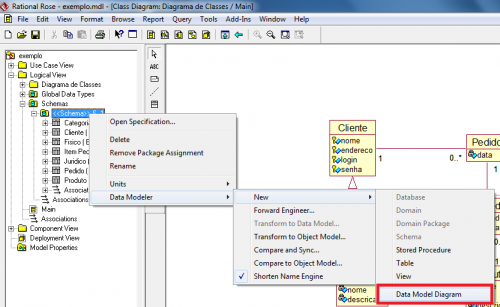
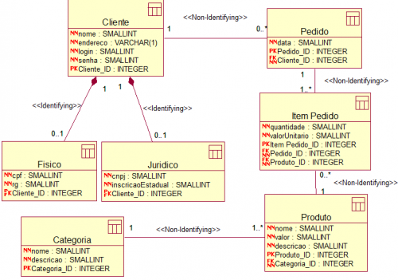
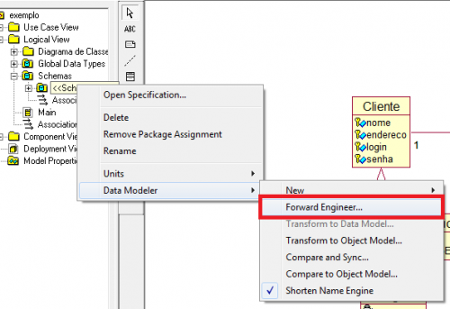

+++
title = "Gerar banco a partir do diagrama de classes (Rational)"
+++

Após finalizar toda an lise sobre a estrutura e funcionalidade do sistema a se densenvolver o próximo passo, basicamente, seria partir para o desenvolvimento.

Sendo assim, por que não aproveitarmos o que j desenvolvido no diagrama de classes?

Por isso, o Rational Rose disponibliza gerar o banco a partir do mapeamento das tabelas de acordo com o nosso diagrama de classes.

Como exemplo, desenvolvi um diagrama de classes simples, referente a pedidos de compras de um cliente.

- Abrir Rational Rose
- Adicionar a pasta Logica View, do novo projeto, um package para conter nosso diagrama de classes.
- Montar o nosso diagrama de classes dentro desse package.

_Criar Package Diagrama_

_Diagrama De Classes Pedido_

E interessante que você já defina o tipo(string, bollean...) de cada atributo de suas classes para ficar mais consistente o diagrama de classes com o banco gerado. (Se não definir agora, ele ir gerar tudo com small int)

Após finalizado seu diagrama de classes, devemos definir quais classes se tornarão tabelas no nosso banco. Para isso fação seguinte em todas as tabelas.

- Botão direito na classe, Open Specification..
- Aba Detail..
- Marque a opção Persistent

_Classes Persistentes (Futuras tabelas no banco)_

_Caso você possua atributo de identificação em suas classes ("id_cliente", "codigo_cliente"...) você deve defini-los como parte do objeto de identificação, se não o Rational ir criar identificadores automaticamente ao gerar as tabelas._

_Para isso faça o seguinte:_

- _Pelo menu em rvore abra a pasta do package que contem seu diagrama de classes._
- _Abra classe por classe e clique com o botão direito no atributo de identificação._
- _Em Data Modeler defina como Part of Object Identity_

**Obs: Essa parte à cima não é muito aconcelhavel pois, na realidade no diagrama de classes não deve conter os diagramas identificadores. Porém, pra quem gosta de trabalhar desta forma, ficou a dica.**

- Agora vamos criar nosso banco, para manter nossas tabelas, que serão geradas posteriormente.

_Criar Banco - Para manter nossas tabelas (Deixe o nome como BancoDados )_

- Transformar nosso modelo de objetos em modelo de dados.

_Transforma Modelo Dados_

- Na janela que abrir , selecione em Target Database o banco que criamos.
- Caso você não deseje que ele criei prefixos no nome de suas tabelas, deixe o Prefix vazio ( Eu sempre deixo vazio).
- Clique em ok.

Agora v em em Schemas, dentro da pasta Logical View e abra o nosso schema criado. Dentro dele estar todas as nossas tabelas geradas ( se estiver faltando alguma é porque você não a marcou como persistente anteriormente.)

Próximo passo, criar o diagrma do modelo de dados:

_Diagrama do modelo de dados (Renomeie o arquivo para ModelodeDados )_

Para adicionar nossas tabelas ao diagrama é muito simples. Basta você arrastar as tabelas do nosso Schema para dentro do nosso Modelo de Dados.

_Diagrama Modelo de Dados_

Após terminar de adicionar todas as tabelas ao modelo você notar que surgiram automaticamente o relacionamento entre as tabelas. Perceba também,-  que se surgiram automaticamente nossas colunas identificadoras, com o sufixo \_ID do nome de cada tabela.

- Agora passe de coluna em coluna em todas as tabelas definindo o tipo e tamanho de cada coluna. _(Se você ja havia definido corretamente o tipo de cada atributo no diagrama de classes, basta você definir o tamanho correto para cada coluna)_

Finalmente, vamos gerar nosso script sql do banco:

_Forward Engineer_

- Na janela que abriu de NEXT/ NEXT/ selecione o nome e local do arquivo sql/NEXT/FINISH.

Pronto, você acabou de gerar o script sql do banco a partir do seu diagrama de classes!!

