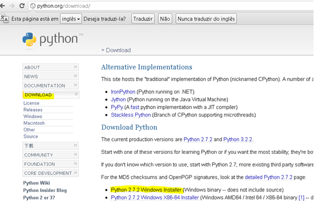
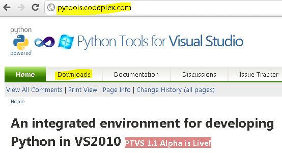
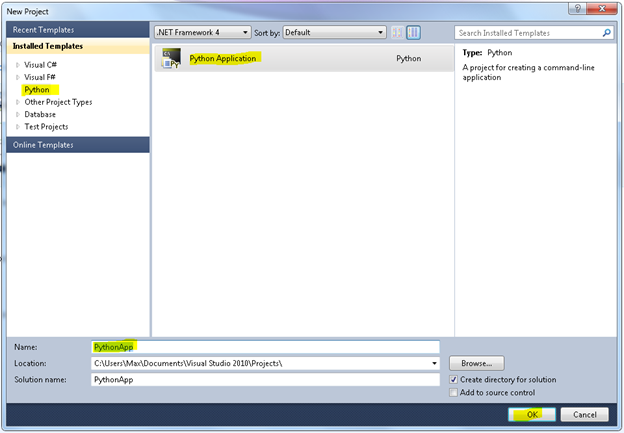
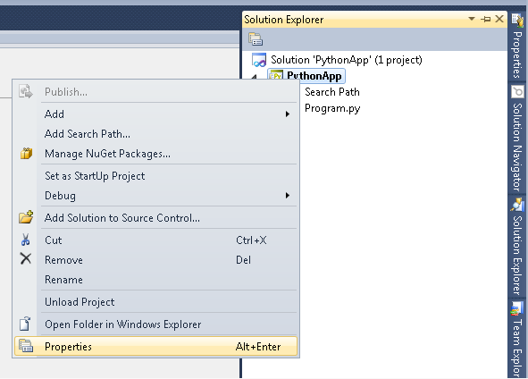
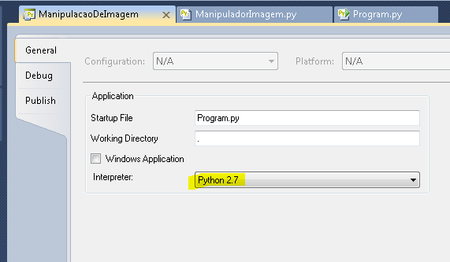

+++
title = "Python no Visual Studio"
+++

Outro dia precisei trabalhar com uma linguagem, que sempre tive fascinação, mas que fazia tempo que não à utilizava.
Estou falando do Python, uma linguagem não muito conhecida e comentada aqui em Londrina. Mas que possui inúmeras vantagens.

Python é uma linguagem script, multiplataforma, simples, elegante, de fácil aprendizado e desenvolvimento. Tem suporte ao paradigma OO, mas também pode ser desenvolvida no formato estrutural. Podendo ser utilizada para rodar scripts direto no shell, ou também desenvolver sistemas Desktops e Web.

Para ter uma noção do espaço que o Python, possui entre os desenvolvedores e o mercado atualmente. A Microsoft possui o [IronPython](http://ironpython.codeplex.com/ "IronPython"), que é a implementação da linguagem Python para a plataforma o .NET. Possibilitando a integração do Python às bibliotecas do Framework .NET.

Objetivo deste post é explicar, como instalar e configurar o Python na IDE Visual Studio 2010. Qualquer um que não  seja do mundo .NET, provavelmente não irá gostar desta ideia, de princípio.
Mas para quem já está acostumado ao ambiente do Visual Studio, fica mais fácil e produtivo. Já que existe suporte IDE para isso e você já está acostumado, de como funciona a IDE e onde estão localizados cada ferramenta utilizadas no processo de desenvolvimento.

Mais dúvidas sobre o Python? [Acesse este artigo](http://www.python.org.br/wiki/PerguntasFrequentes/SobrePython#O_que_.2BAOk_Python.3F).

Faça o download da versão 2.7.2  Python no site [http://www.python.org/download/](http://www.python.org/download/)

Após instalado o Python. Faça o download do Python Tools for Visual Studio. Que é uma ferramenta para possibilitar o desenvolvimento Python na no Visual Studio.



O download do instalador está no codeplex: [http://pytools.codeplex.com/](http://pytools.codeplex.com/)



Com a ferramenta instalada, estamos prontos para iniciar o desenvolvimento Python, através do Visual Studio.

Abra o Visual Studio e crie um novo projeto do tipo "Python Application":



Em seguida vamos configurar o projeto, para definir que os scripts aqui desenvolvidos serão executados no Interpretador Python 2.7.2 que instalamos anteriormente.



Selecione o interpretador correto:



Escreva algum código em Python para testar:

```py
# O famoso Hello World
print('Hello World n')

\# Criacao de vairaveis e atribuicao de valores a elas
a = 2
b = 3
resultado = 2 + 3

\# Formatacao da string
print( "2 + 3 = {0}n".format(resultado))

\# Le o valor digitado
numInput = input('Escolha um numero: ')

try:
# Tenta converter para inteiro
num = int(numInput)

if num < 5:
# Exibi o valor digitado
print ('Voce digitou um valor menor que 5: {0}'.format(num))
else:
# Exibi o valor digitado
print ('Voce digitou um vlaor maior que 5: {0}'.format(num))

except:
# Exibi mensagem de erro
print('Valor incorreto')

\# Espera que digite uma tecla para sair
input ('Digite algo para sair')
```

Por final, só executar o Start Debugging (F5) e o script será executado em um console.

Note como o código Python é simples e elegante. Python utiliza a própria identação do código para formar os blocos de código.

