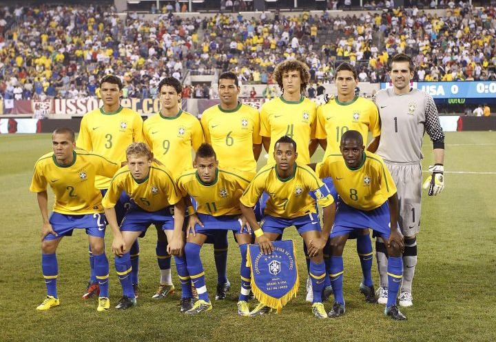
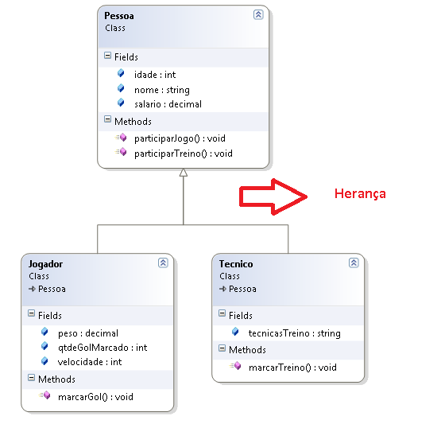
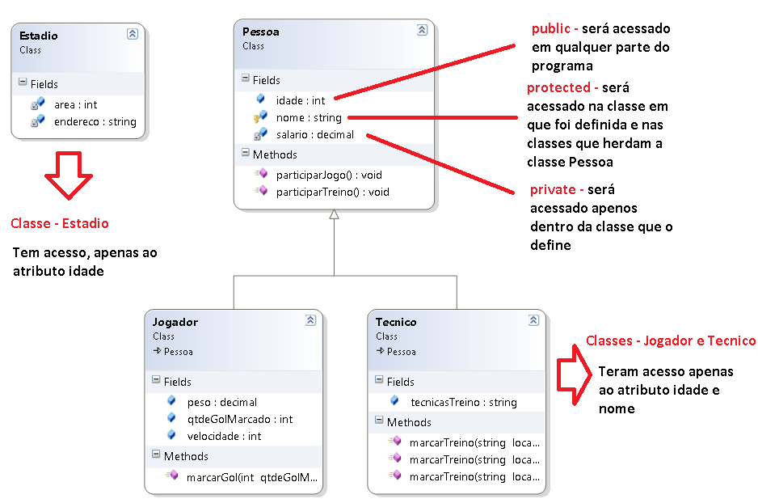

+++
title = "Programação Orientada a Objetos (POO) - I"
+++

# Programação Orientada a Objetos (POO)

Orientação a objetos é um paradigma de programação organizado através de objetos. Isto é, quando utilizamos POO, estamos facilitando a forma de compreensão e implementação de um projeto. Porque, simplesmente estamos se preocupando na forma em que as informações são definidas, como característica e comportamentos, e como elas se relacionam entre si.

Para ficar mais fácil, precisamos analisar o contexto de um  projeto. Como exemplo utilizarei um time de futebol.

## Classes

Classes organizam características e comportamentos comuns a um grupo de informações.

Sendo assim podemos definir que todas as pessoas em um time de futebol, fazem parte da classe **Pessoa**.  Pois, todas elas possuem características e comportamentos comuns.

**Classe Pessoa**

 [](http://blog2.maxcnunes.com/wp-content/uploads/2011/11/POO-jogadores.jpg)

**Características**

- Nome
- Idade
- Salário

**Comportamentos**

- Participa dos jogos
- Participa dos treinos

 [](http://blog2.maxcnunes.com/wp-content/uploads/2011/11/POO-DC-Pessoa.png)

```cs
public class Pessoa
{
    public string nome;
    public int idade;
    public decimal salario;

    public void participarJogo() { }

    public void participarTreino() { }
}
```

## Atributos

São as características de cada objeto. Como: **_Nome, Idade, Situação e Salário_**.

```cs
public string nome;
public int idade;
public decimal salario;
```

## Métodos

São comportamentos de cada objeto. Como: **_Participar do jogo e Participar do treino_**.

```cs
public void participarJogo() { }

public void participarTreino() { }
```

## Objetos

São instancias de uma classe. Ou seja, sendo que definimos uma Classe Pessoa possui características como: **_Nome, Idade, Situação e Salário_** e comportamentos como: **_Participar do jogo e Participar do treino_**. Ao instanciar um objeto desta classe, devemos cria-lo segundo as definições da classe que ele está sendo gerado.

Por exemplo:

**Pessoas - Time Futebol**

 [](http://blog2.maxcnunes.com/wp-content/uploads/2011/11/POO-neymar.jpg)

**Tipo do objeto:**Pessoa**Características**

- Nome: Neymar
- Idade: 19 anos
- Salário: 800.000,00

**Comportamentos**

- Participa dos jogos
- Participa dos treinos

```cs
//Istanciação do objeto
Pessoa pes_Neymar = new Pessoa();

//Atribuição de valores aos atributos
pes_Neymar.nome = "Neymar";
pes_Neymar.idade = 19;
pes_Neymar.salario = 8000000;

//Execução dos métodos
pes_Neymar.participarJogo();
pes_Neymar.participarTreino();
```

## Método Construtor

Para estanciar um objeto, utilizamos o método construtor da classe. Método construtor deve ter exatamente o mesmo nome da classe e não devem possuir um tipo de retorno na sua definição. Porque, ele já é responsável por retornar um objeto do tipo da classe que pertence.

```cs
public class Pessoa
{
    public int idade;
    protected string nome;
    private decimal salario;

    //Método construtor
    public Pessoa()
    {
        //Possui o mesmo nome da classe
        //Não possui um tipo de retorno
    }

    public void participarJogo() { }

    public void participarTreino() { }
}
```

## Herança

É a generalização das informações. Ou seja, dentro de um time de futebol temos dois tipos de pessoas: jogadores e o técnico. E cada um desses tipos, possui algumas características e comportamentos, comuns e outras diferentes.

Um jogador, além de possuir as outras características de pessoas, possui também **_quantidade de gols marcados, peso, velocidade_** e o comportamento de **_marcar gol_**.

Um técnico, além de possuir as outras características de pessoas, possui também **_técnicas de treino_** e o comportamento de **_marcar treino_**.

Para atender a este tipo de situação, podemos criar duas classes diferentes, mas herdando características e comportamentos comuns, definidos na classe Pessoa.

**Pessoas - Time Futebol**

**Jogadores**

**Técnico**

 [](http://blog2.maxcnunes.com/wp-content/uploads/2011/11/POO-PessoaJogdores.jpg)

 [](http://blog2.maxcnunes.com/wp-content/uploads/2011/11/POO-PessoaTecnico.jpg)

 [](http://blog2.maxcnunes.com/wp-content/uploads/2011/11/POO-DC-Heranca.png)

```
public class Jogador : Pessoa
{
    public int qtdeGolMarcado;
    public decimal peso;
    public int velocidade;

    public void marcarGol() { }
}
```

```cs
public class Tecnico : Pessoa
{
    public string tecnicasTreino;

    public void marcarTreino() { }
}
```

## Sobrecarga

São como comportamentos comuns, na vida real. Mas com algumas particularidades, que os diferem.

Na POO, são métodos com o mesmo nome, mas com a assinatura dos parâmetros diferentes.

```cs
public void marcarTreino(string local)
{
    //Marca o treino definindo apenas o local
}

public void marcarTreino(string local, int horario)
{
    //Marca o treino definindo o local e o horário
}

public void marcarTreino(string local,int horario, int qtdJogadores)
{
    //Marca o treino definindo o local, horário e quantidade de jogadores
}
```

## Referência this

Especifica que estamos referenciando apenas as características e métodos da própria classe.

Por exemplo, se eu passo por parâmetro a quantidade de gols marcado em uma partida, com o mesmo nome, da propriedade **_qtdeGolMarcado_**, existente na classe. Para especificar qual é variável, que representa minha propriedade existente na classe, devo utilizar o prefixo **_this._**

```cs
public void marcarGol(int qtdeGolMarcado)
{
    this.qtdeGolMarcado = qtdeGolMarcado;
}
```

## Modificadores de Acesso

Um modificador de acesso determina até onde o atributo ou método pode ser visualizado, ou seja,  determinam quais os locais ele pode ser usado. Eles são o utilizados no encapsulamento. Temos pelo menos 3 tipos de modificadores de acesso padrões, na maioria das linguagens POO:

[](http://blog2.maxcnunes.com/wp-content/uploads/2011/11/POO-pulica.png)

**public** Acesso não é restrito. Membro é acessado de qualquer lugar.

[](http://blog2.maxcnunes.com/wp-content/uploads/2011/11/POO-protected.png)

**protected** Pode ser acessado dentro da classe que o define e pelas classes que a herdam.

[](http://blog2.maxcnunes.com/wp-content/uploads/2011/11/POO-private.png)

**private** Membro pode ser a cessado somente dentro da classe que o define.

 [](http://blog2.maxcnunes.com/wp-content/uploads/2011/11/POO-DC-ModificadorAcesso.png)

```cs
public int idade;
protected string nome;
private decimal salario;
```

Por enquanto é isto. No próximo artigo continuarei com outros conceitos de POO.

