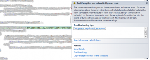
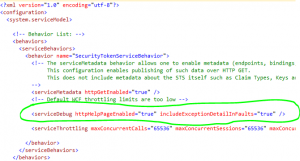

+++
title = "Exceções não detalhadas em erros providos de uma aplicação WCF"
+++

Se ao debugar o projeto, após configurar a autenticação "Claims-based authentication" no Sharepoint 2010, está apresentando a seguinte mensagem:

*"The server was unable to process the request due to an internal error. For more information about the error, either turn on IncludeExceptionDetailInFaults (either from ServiceBehaviorAttribute or from the configuration behavior) on the server in order to send the exception information back to the client, or turn on tracing as per the Microsoft .NET Framework 3.0 SDK documentation and inspect the server trace logs."* 



Este é um problema comum, ao utilizar serviços WCF, que por padrão vem com o detalhamento de exceções desabilitado para seus clientes. 

Precisamos fazer algumas configurações no webconfig. Neste caso por estarmos falando do "SPClaimsUtility.AuthenticateFormUser" a aplicação é o Security Token, localizado por padrão em: 

```
_C:Program FilesCommon FilesMicrosoft SharedWeb Server Extensions14WebServicesSecurityToken_
```

Com o webconfig aberto, insira dentro de "behavior" o seguinte trecho de código:

```xml
<serviceDebug httpHelpPageEnabled="true" includeExceptionDetailInFaults="true" />
```



Após isto, salve o webconfig e renicie o IIS. Com essa configuração na próxima vez que ocorrer um erro dentro do WCF, será exibido o erro detalhado e você será capaz de entender o que está acontecendo realmente.

