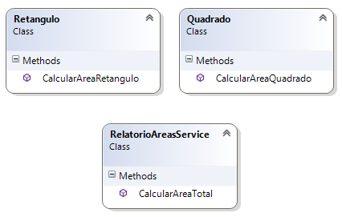
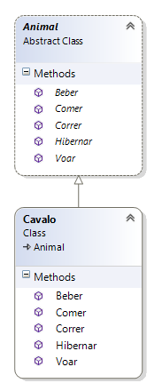
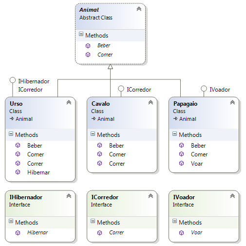
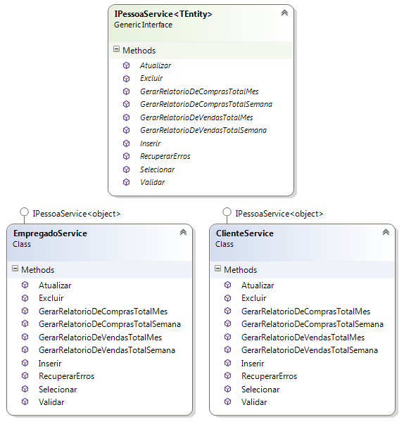

+++
title = "SOLID Principles"
+++

Robert C. Martin “Uncle Bob” descreve os princípios SOLID, em “Agile Software Development: Principles, Patterns and Practices”, como cinco diretrizes para serem seguidas no que aumentariam a qualidade do código OO, facilitando a manutenção e alterações do código de acordo com as mudanças de requisitos.

## Sintomas de um Design Pobre

Segundo Uncle Bob existiriam alguns sintomas que demonstrariam quando um software está mal planejado e codificado. Os sintomas são definidos da seguinte forma:

1.  Rigidez (Rigidity) - O design é difícil de ser alterado.
2.  Fragilidade (Fragility) - O design é fácil de ser quebrado.
3.  Imobilidade (Immobility) - O design é difícil de ser reutilizado.
4.  Viscosidade (Viscosity) - É difícil de ser fazer a coisa certa.
5.  Precisa de menos complexidade (Needless Complexity) - O design está sobrecarregado.
6.  Precisa de menos repetição (Needless Repetition) – O design está repetido.
7.  Opacidade (Opacity) – Design desorganizado e difícil de entender.

##  

## Princípios SOLID

O SOLID são princípios no design orientado a objeto que ajudariam desenvolvedores a eliminar os sintomas de um design pobre e construir um design melhor para a definição de novas funcionalidades. Os princípios são os seguintes:

1.  SRP (The Single Responsibility Principle) – O Princípio da Responsabilidade Única.
2.  OCP (The Open-Closed Principle) – O Princípio Aberto-Fechado.
3.  LSP (The Liskov Substitution Principle) – O Princípio da Substituição de Liskov.
4.  ISP (The Interface Segregation) – O Princípio da Segregação de Interface.
5.  DIP (The Dependency Inversion) – O Princípio de Dependência.

####  

##  

## SRP - O Princípio da Responsabilidade Única

O SRP trata que uma classe não deveria ter mais de uma razão para ser alterada. Isto significa que você deveria projetar sua classe para servir um único propósito. Não precisamos extrapolar e implementar apenas um método por classe, mas que todos os membros da classe sejam relacionados a função principal da classe. Quando pensamos em uma classe com múltiplas responsabilidades, deveríamos pensar melhor e separar essas diferentes reponsabilidades em novas classes.

Cada vez que uma classe é modificada o risco de surgirem novos bugs aumenta. Seguindo o SRP o risco de afetarem mais partes do sistema, como classes dependentes, é mitigado.

**Exemplo:**

**ERRADO**

É muito comum, infelizmente, vermos desenvolvedores atribuindo múltiplas responsabilidades para uma única classe ou método. Como esta classe empregado, além dos comportamentos esperados de um objeto empregado, ele ainda possui a responsabilidade de salvar as informações no banco e gerar relatórios.

[](./clip_image001.png)

**CORRETO**

Modularize a classe anterior atribuindo às responsabilidades corretas para cada classe gerada:

[](./clip_image003.jpg)

##  

## OCP – O Princípio Aberto-Fechado

O ORP define que entidades (classes, módulos, funções, etc) deveriam ser abertas para extensões, mas fechadas para modificações. O “fechado” trata da regra na qual um módulo desenvolvido e testado, este código deveria somente ser ajustado para corrigir bugs. O “aberto” trata da regra na qual deveria ser capaz de estender o código existente para introduzir novas funcionalidades.

Assim como o SRP, este princípio reduz o risco de novos erros sendo introduzidos a partir de alterações no código existente.

**Exemplo**

**ERRADO**

Suponha que você possui um relatório que deveria fazer o calculo de todas as áreas utilizadas em um sistema. Muitos provavelmente fariam da forma abaixo, criando objetos diferentes com métodos de calculo específicos para cada um e na classe de relatório passariam uma lista de cada tipo de objeto para realizar o calculo total de áreas:

[](./clip_image004.png)

```cs
class Quadrado
    {
        public decimal CalcularAreaQuadrado()
        {
            return 0;// Suponha que esteja implementado o calculo correto
        }
    }

class Retangulo
{
public decimal CalcularAreaRetangulo()
{
return 0;// Suponha que esteja implementado o calculo correto
}
}

class RelatorioAreasService
{
public decimal CalcularAreaTotal(List quadrados, List retangulos)
{
decimal areaTotal = 0;

            foreach (Quadrado item in quadrados)
                areaTotal += item.CalcularAreaQuadrado();

            foreach (Retangulo item in retangulos)
                areaTotal += item.CalcularAreaRetangulo();

            return areaTotal;
        }
    }
```

Mas e se surgisse uma nova forma geométrica no sistema? Da forma a cima você teria que modificar a classe relatório o que violaria o OCP.

**CORRETO**

Pense da seguinte forma, você sabe que a classe relatório deve calcular a área de qualquer objeto que saiba como calcular sua própria área. Dessa forma o melhor seria que cada um desses objetos implementassem um comportamento comum definido por uma interface.

[](./clip_image005.png)

```cs
interface IArea
    {
        decimal CalcularArea();
    }

class Retangulo : IArea
{
public decimal CalcularArea()
{
return 0;// Suponha que esteja implementado o calculo correto
}
}

class Quadrado : IArea
{
public decimal CalcularArea()
{
return 0;// Suponha que esteja implementado o calculo correto
}
}

class RelatorioAreasService
{
public decimal CalcularAreaTotal(List areas)
{
decimal areaTotal = 0;

            foreach (IArea item in areas)
                areaTotal += item.CalcularArea();

            return areaTotal;
        }
    }
```

Agora esta abordagem não está violando o OCP porque o código está fechado para modificações, se um dia surgir um objeto triangulo, não seria necessário modificar a classe relatório para realizar o calculo total e da mesma forma está aberta para extensões porque bastaria que a classe triângulo implementasse a interface IArea e ela já estaria apta para estender o relatório para essa nova forma geométrica.

##  

## LSP – O Princípio da Substituição de Liskov

O LSP foi nomeado dessa forma por causa de Barbara Liskov que afirmou em 1988 que “funções que utilizam referencias para classes base devem ser capaz de utilizar objetos derivados da classe derivada sem conhecê-los”.

Se você cria uma superclasse com certos comportamentos definidos e em seguida cria outra classe herdando a classe anterior, mas nessa subclasse você não implementa os comportamentos corretamente, ou seja, sobrescreve qualquer comportamento com um procedimento vazio ou lança alguma exceção em seu lugar, então você está violando o LSP.

Para simplificar, pense no LSP como uma forma de garantir que a herança seja utilizada corretamente.

**Exemplo:**

Vamos considerar que exista a superclasse Animal e seja herdada pela subclasse classe Cavalo.

**ERRADO**

[](./clip_image006.png)

**Todos sabem que um Cavalo não possui comportamentos de Hibernar e Voar!!!**

[](./clip_image0081.png)

Então o código implementado ficaria assim:

```cs
public abstract class Animal
    {
        public abstract void Comer();
        public abstract void Beber();
        public abstract void Correr();
        public abstract void Voar();
        public abstract void Hibernar();
    }

public class Cavalo : Animal
{
public override void Comer()
{
//Implementar comportamento
}

        public override void Beber()
        {
            //Implementar comportamento
        }

        public override void Correr()
        {
            //Implementar comportamento
        }

        public override void Voar()
        {
            //Não Implementar comportamento
        }

        public override void Hibernar()
        {
            //Disparar exceção
            throw new NotImplementedException();
        }
    }
```

A implementação a cima foi uma forma frustrante de tentar cumprir os comportamentos impostos pela superclasse, o que nos fez violar o LSP e o SRP.

Então você se pergunta, mas por que violou o LSP, se foram “implementados” todos os métodos no cavalo? Para facilitar o entendimento imagine que exista uma classe responsável por gerar o relatorio de migração dos animas, da seguinte forma:

```cs
class RelatorioMigracao
    {
        void GerarRelatorioMigracaoDeInverno(IList animais)
        {
            foreach (Animal animal in animais)
                animal.Voar();
        }
    }
```

Por mais que a classe derivada (Cavalo) possua a implementação para o método Voar, quando a classe base (Animal) tentar executar esse comportamento, nada ocorrerá porque enganamos a herança implementando um comportamento vazio e como eu já mencionei o LSP diz claramente: “funções que utilizam referencias para classes base devem ser capaz de utilizar objetos derivados da classe derivada sem conhecê-los”.

**CORRETO**

Para resolver o problema anterior seria melhor separar especialidades em interfaces e manter comportamentos comuns na classe base. Ficando da seguinte forma:

[](./clip_image009.png)

##  

## ISP – O Princípio da Segregação de Interface

O Princípio da Segregação de Interface (ISP) determina que os clientes não devam ser forçados a depender de interfaces que eles não usam. Esta regra significa que, quando uma classe depende de outra, o número de membros na interface que é visível para a classe dependente deve ser minimizado.

Muitas vezes, quando você cria uma classe com um grande número de métodos e propriedades, a classe é usada por outros tipos que exigem apenas o acesso a um ou dois membros. Quando você segue o ISP, classes grandes implementam múltiplas interfaces menores que podem ser agrupadas de acordo com a necessidade. Os dependentes são vinculados a essas interfaces, aumentando a robustez, flexibilidade e a possibilidade de reutilização.

**Exemplo**:

**ERRADO**



**CORRETO**

Segregando as interfaces aumentamos a reusabilidade e não impomos comportamentos indevidos para cada classe:


##  

## DIP – O Princípio da Inversão de Dependência

O Princípio da Inversão de Dependência (DIP) é a última das cinco regras. O DIP faz duas afirmações. A primeira é a de que os módulos de alto nível não devem depender de módulos de baixo nível. Ambos devem depender de abstrações. A segunda parte da regra é que abstrações não devem depender de detalhes. Detalhes devem depender abstrações.

O DIP se relaciona principalmente com o conceito de camadas dentro de aplicativos, onde os módulos de nível inferior lidam com funções muito detalhadas e módulas de nível superior usam classes de nível inferior para realizar tarefas maiores. O princípio especifica que, quando existem dependências entre as classes, eles devem ser definidos usando abstrações, como interfaces, ao invés de referenciando classes diretamente. Isso reduz a fragilidade causada por alterações em módulos de baixo nível introduzir erros nas camadas mais altas. A DIP é comumente utilizada com injeção de dependência.

**Exemplo:**

**ERRADO**

```cs
class Email
    {
        public void Enviar()
        {

        }
    }

class Notificador
{
private Email \_email;

        public Notificador()
        {
            _email = new Email();
        }

        public void NotificarAlteracaoDeSenha()
        {
            _email.Enviar();
        }
    }
```

**CORRETO**

De a forma a seguir a classe de alto nível (Notificador) não depende mais de uma classe de baixo nível (Email) e sim de uma abstração (IMensagemService).

```cs
interface IMensagemService
    {
        void Enviar();
    }

class Email : IMensagemService
{
public void Enviar()
{

        }
    }

class Notificador
{
private IMensagemService \_email;

        public Notificador()
        {
            _email = new Email();
        }

        public void NotificarAlteracaoDeSenha()
        {
            _email.Enviar();
        }
    }
```

