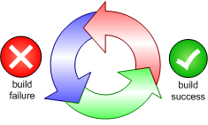
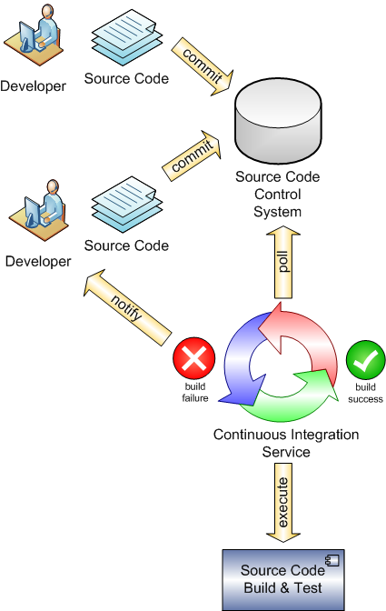
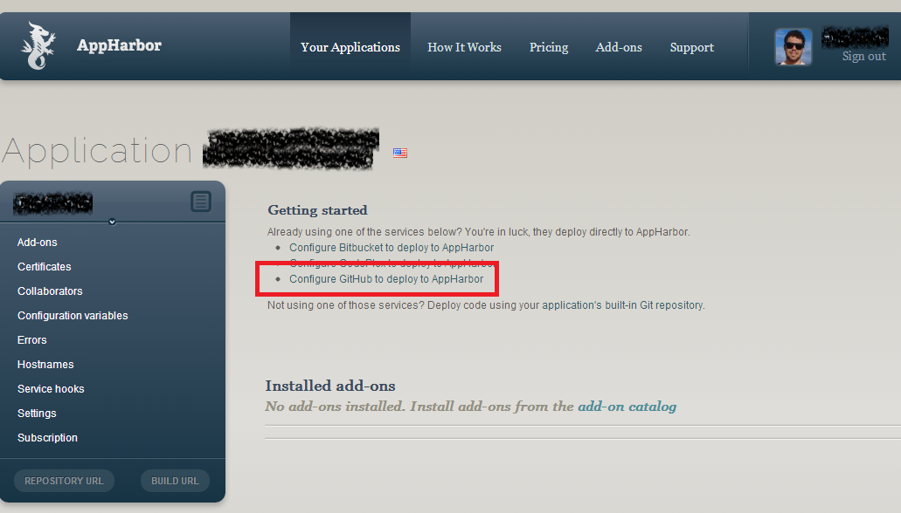
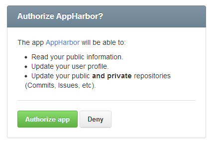
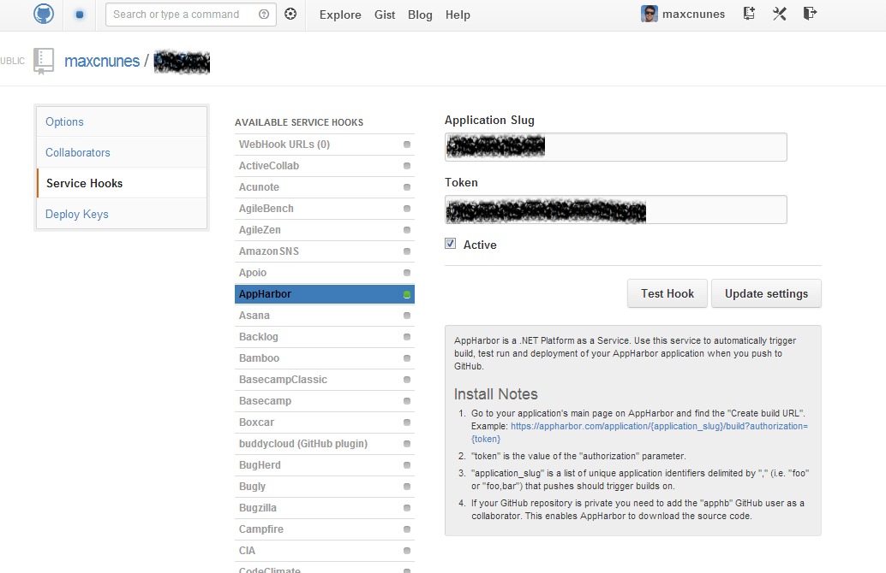
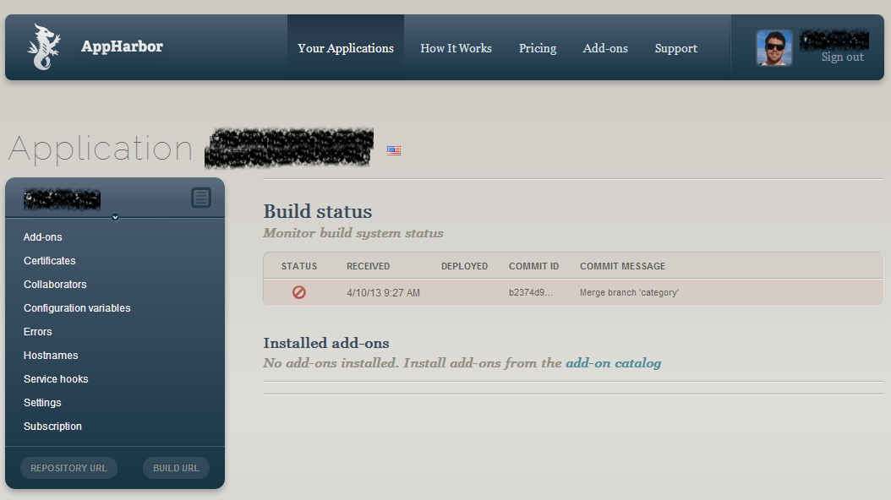
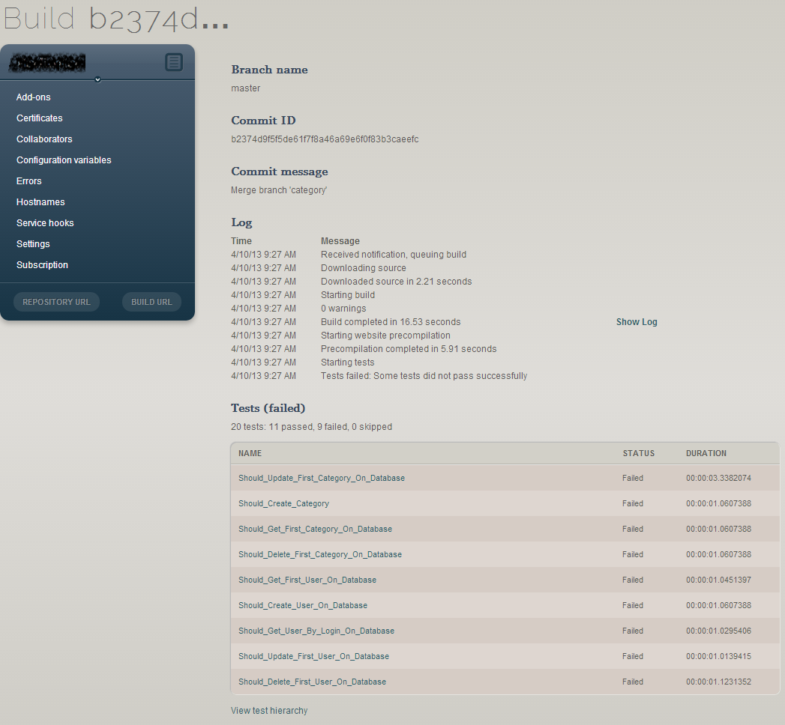

+++
title = "Configurando Continuous Integration para .NET com AppHarbor e Github"
+++

Um dos projetos que tenho trabalhado ultimamente tem crescido aos poucos e já começa a apresentar alguns problemas comuns de qualquer projeto. As alterações no código realizadas por implementações de novas features ou correções de bugs podem ser commitadas com algum problema que quebre o build ou até mesmo imperceptivelmente interfira no comportamento de uma feature existente.

###  

####  

####  

#### Como identificar que tais alterações estão afetando as featurues existentes? 

- **Testes!**

#### Como identificar tais problemas da formar mais cedo possível?

- **Integração Contínua (CI)**

Martin Fowler define a Integração Contínua da seguinte forma:

> _Continuous Integration is a software development practice where members of a team integrate their work frequently, usually each person integrates at least daily – leading to multiple integrations per day. Each integration is verified by an automated build (including test) to detect integration errors as quickly as possible. Many teams find that this approach leads to significantly reduced integration problems and allows a team to develop cohesive software more rapidly._  – Martin Fowler

Ou seja, é uma prática de desenvolvimento para facilitar a identificação de erros provocados por integrações de tarefas realizadas diariamente. É contínuo exatamente porque o quanto antes for identificado o problema, melhor. E para que realmente seja um processo contínuo, deve ser automatizado.

Então automatizando builds e testes para serem executados a partir de cada integração você conseguirá identificar qual foi o commit e desenvolvedor responsável pelo problema.

**_Continuous Integration Workflow_**

_http://blogs.collab.net/cloudforge/continuous-integration-overview-best-practice_

### AppHarbor

AppHarbor é uma hospedagem para aplicações web na plataforma .NET. Dentre vários add-ons disponíveis, ela ainda possui serviço de Continuous Integration. O mais interessante é que o serviço de CI é gratuito e fácil de configurar com o Github.

**Configurando Continuous Integration no AppHarbor e Github**

1\. Crie uma Application para o seu projeto no AppHarbor.

2\. Autorize o acesso da sua conta no Github.

3\. Selecione o repositório relacionado a esta aplicação.

4\. Acesse o Settings do seu repositório no Github para confirmar se a configuração foi realizada  com sucesso.

5\. De volta no AppHarbor acesse o painel de controle referente a esta aplicação e agora irá conter informações sobre os builds realizados.

6\. Clique sobre o build e será exibido informações mais detalhadas.

7\. Através do Commit Id você consegue descobrir quem realizou o commit.

